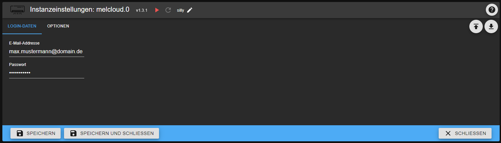

# MELCloud - Benutzerhandbuch

## Voraussetzungen

Um diesen Adapter korrekt verwenden zu können, müssen folgende Vorbereitungen getroffen werden:

* Mitsubishi-Gerät mit Wi-Fi-Adapter
* MELCloud-Account unter der [offiziellen Website](https://app.melcloud.com/) angelegt
* Gerät wurde im Account registriert und vollständig eingerichtet

## Hinweise

* Ab v1.1.1 wurde die Ver-/Entschlüsselung des Passworts geändert. Daher muss bei einem Upgrade einmalig das Passwort erneut in den Adapter-Einstellungen eingeben werden. Ansonsten schlägt die Anmeldung fehl und der Adapter bleibt auf rot.
* Ab v1.1.3 muss js-controller mindestens in der Version 3.1 installiert sein.
* Bei einem Upgrade auf v1.2.0 (oder höher) bitte einmalig die Objektstrukturen unter "melcloud.X.devices.Y.reports" komplett löschen und den Adapter neustarten, damit diese neu angelegt werden können. Die neue Struktur ist weiter unten beschrieben.

## Konfiguration

An dieser Stelle kann die jeweilige Adapter-Instanz konfiguriert werden. Zwingend nötig für die Funktionalität sind die Zugangsdaten (E-Mail-Adresse und Passwort) des MELCloud-Accounts. Zusätzlich kann die Region des Accounts angegeben werden.

Zusätzlich wird hier das Intervall (in Minuten) angegeben, wie oft Daten von der MELCloud abgerufen und gespeichert werden sollen. Das kleinstmögliche Intervall ist eine Minute. Sollte es während des Betriebs des Adapters zu Verbindungsproblemen mit der MELCloud (z.B. Serverausfall, Internetabbruch) kommen, so wird höchstens noch dreimal versucht, eine Verbindung herzustellen. Sollte dies dann auch nicht gelingen, so wird der nächste Versuch erst in einer Stunde stattfinden.

## Objekte

Nachdem die Adapter-Instanz (X) erfolgreich (=grün) gestartet wurde, werden die Geräte inklusive Daten aus der MELCloud abgerufen. Für jedes Gerät (Y) wird ein separater Objekt-Knoten angelegt.

### melcoud.X.info

| ID | lesbar | änderbar | Bemerkung |
|--- | :---: | :---: |--- |
| connection | X | - | Gibt den Verbindungsstatus zur MELCloud an |

### Luft-Luft-Wärmepumpen (Klimageräte)
#### melcloud.X.devices.Y.info

| ID | lesbar | änderbar | Bemerkung |
|--- | :---: | :---: |--- |
| actualFanSpeed | X | - | Tatsächliche Lüfterstufe im Automatikmodus |
| buildingId | X | - | Zugeordnete Gebäude-ID |
| canCool | X | - | Fähigkeit zu kühlen |
| canHeat | X | - | Fähigkeit zu heizen |
| canDry | X | - | Fähigkeit zu entfeuchten |
| deviceName | X | - | Name des Geräts |
| deviceOnline | X | - | Gibt an, ob das Gerät erreichbar ist |
| floorId | X | - | Zugeordnete Etagen-ID |
| lastCommunication | X | - | Zeitstempel der letzten Kommunikation (MELCloud -> Gerät) |
| minTempCoolDry | X | - | Minimale Temperatur (Kühlen/Entfeuchten) |
| maxTempCoolDry | X | - | Maximale Temperatur (Kühlen/Entfeuchten) |
| minTempHeat | X | - | Minimale Temperatur (Heizen) |
| maxTempHeat | X | - | Maximale Temperatur (Heizen) |
| minTempAuto | X | - | Minimale Temperatur (Automatik) |
| maxTempAuto | X | - | Maximale Temperatur (Automatik) |
| macAddress | X | - | MAC-Adresse des Geräts |
| nextCommunication | X | - | Zeitstempel der nächsten Kommunikation (MELCloud -> Gerät) |
| numberOfFanSpeeds | X | - | Anzahl der verfügbaren Lüfterstufen |
| roomTemp | X | - | Aktuelle Raumtemperatur |
| serialNumber | X | - | Seriennummer des Geräts |

#### melcloud.X.devices.Y.control

| ID | lesbar | änderbar | Bemerkung |
|--- | :---: | :---: |--- |
| fanSpeed | X | X | Aktuelle Lüfterstufe des Geräts (0=Automatik, 1...'numberOfFanSpeeds'= minimale bis maximale Stufe) |
| mode | X | X | Betriebsmodus des Geräts (1=Heizen, 2=Entfeuchten, 3=Kühlen, 7=Lüften, 8=Automatik) |
| power | X | X | Hauptschalter (schaltet Gerät ein bzw. aus) |
| targetTemp | X | X | Zieltemperatur des Geräts |
| vaneHorizontalDirection | X | X | Aktuelle horizontale Ausrichtung des Luftauslasses (0=Automatik, 1...5=ganz links bis ganz rechts, 8=50/50 (nur bei Geräten mit 2 getrennten Luftauslässen), 12=Swing) |
| vaneVerticalDirection | X | X | Aktuelle vertikale Ausrichtung des Luftauslasses (0=Automatik, 1...5=ganz oben bis ganz unten, 7=Swing) |

#### melcloud.X.devices.Y.reports

Um Berichte abrufen zu können, müssen zunächst Start- ("startDate") und Endzeitpunkt ("endDate") korrekt festgelegt werden. Dabei ist das Format JJJJ-MM-TT zu beachten! Zur eigentlichen Durchführung des Abrufs muss der Datenpunkt "getPowerConsumptionReport" getriggert werden.
Kurz darauf werden die entsprechenden Datenpunkte im Unterkanal "lastReportData" mit den Werten aus der Cloud befüllt.

| ID | lesbar | änderbar | Bemerkung |
|--- | :---: | :---: |--- |
| startDate | X | X | Beginn des Abrufzeitraums der Berichte (Format: JJJJ-MM-TT, z.B. 2020-05-31) |
| endDate | X | X | Ende des Abrufzeitraums der Berichte (Format: JJJJ-MM-TT, z.B. 2021-01-08) |
| getPowerConsumptionReport | - | X | Schalter, um das Abrufen der Berichte anzustoßen |

##### melcloud.X.devices.Y.reports.lastReportData -- Adapter-Version 1.2.0 oder höher erforderlich

Hier werden die Verbrauchsdaten für den angeforderten Berichtszeitraum abgelegt.

| ID | lesbar | änderbar | Bemerkung |
|--- | :---: | :---: |--- |
| totalMinutes | X | - | Zeitraum des gemessenen Verbrauchs (in Minuten) |
| totalPowerConsumption | X | - | Gesamtverbrauch aller Modi (in kWh) |
| totalPowerConsumption*Betriebsmodus* | X | - | Gesamtverbrauch im Modus *Betriebsmodus* (in kWh) - wird für jeden Betriebsmodus angelegt |
| rawPowerConsumptionData | X | - | Unverarbeite Rohantwort der MELCloud (als JSON) zur eigenen Verarbeitung |

### Luft-Wasser-Wärmepumpen -- Adapter-Version 1.2.0 oder höher erforderlich
#### melcloud.X.devices.Y.info

| ID | lesbar | änderbar | Bemerkung |
|--- | :---: | :---: |--- |
| buildingId | X | - | Zugeordnete Gebäude-ID |
| canCool | X | - | Fähigkeit zu kühlen |
| canHeat | X | - | Fähigkeit zu heizen |
| condensingTemperature | X | - | Kondensationstemperatur 
| deviceName | X | - | Name des Geräts |
| deviceType | X | - | Gerätetyp (0=Luft-Luft-Wärmepumpe / Klimaanlage, 1=Luft-Wasser-Wärmepumpe) |
| deviceOnline | X | - | Gibt an, ob das Gerät erreichbar ist |
| floorId | X | - | Zugeordnete Etagen-ID |
| flowTemperature | X | - | Vorlauftemperatur 
| flowTemperatureBoiler | X | - | Vorlauftemperatur des Boilers
| flowTemperatureZone1 | X | - | Vorlauftemperatur Zone 1 
| flowTemperatureZone2 | X | - | Vorlauftemperatur Zone 2 (falls vorhanden)
| hasZone2 | X | - | Flag, ob das Gerät einen zweiten Kreislauf hat |
| lastCommunication | X | - | Zeitstempel der letzten Kommunikation (MELCloud -> Gerät) |
| macAddress | X | - | MAC-Adresse des Geräts |
| mixingTankWaterTemperature | X | - | Temperatur des Mischwassertanks
| nextCommunication | X | - | Zeitstempel der nächsten Kommunikation (MELCloud -> Gerät) |
| outdoorTemperature | X | - | Außentemperatur 
| returnTemperature | X | - | Rücklauftemperatur 
| returnTemperatureBoiler | X | - | Rücklauftemperatur des Boilers
| returnTemperatureZone1 | X | - | Rücklauftemperatur Zone 1 
| returnTemperatureZone2 | X | - | Rücklauftemperatur Zone 2 (falls vorhanden)
| roomTemperatureZone1 | X | - | Raumtemperatur des ersten Kreislaufs
| roomTemperatureZone2 | X | - | Raumtemperatur des zweiten Kreislaufs (falls vorhanden)
| serialNumber | X | - | Seriennummer des Geräts |
| tankWaterTemperature | X | - | Temperatur des Wasserspeichers

#### melcloud.X.devices.Y.control

| ID | lesbar | änderbar | Bemerkung |
|--- | :---: | :---: |--- |
| forcedHotWaterMode | X | X | Betriebsmodus Warmwasser (false=Automatisch, true=WW-Vorrang) |
| operationModeZone1 | X | X | Betriebsmodus des ersten Kreislaufs (0=HEATTHERMOSTAT, 1=HEATFLOW, 2=CURVE, 3=COOLTHERMOSTAT, 4=COOLFLOW) |
| operationModeZone2 | X | X | Betriebsmodus des zweiten Kreislaufs, falls vorhanden (0=HEATTHERMOSTAT, 1=HEATFLOW, 2=CURVE, 3=COOLTHERMOSTAT, 4=COOLFLOW) |
| power | X | X | Hauptschalter (schaltet Gerät ein bzw. aus) |
| setTankWaterTemperature | X | X | Zieltemperatur des Wasserspeichers |
| setCoolFlowTemperatureZone1 | X | X | Zieltemperatur des ersten Kühlvorlaufes |
| setCoolFlowTemperatureZone2 | X | X | Zieltemperatur des zweiten Kühlvorlaufes (falls vorhanden) |
| setHeatFlowTemperatureZone1 | X | X | Zieltemperatur des ersten Heizvorlaufes |
| setHeatFlowTemperatureZone2 | X | X | Zieltemperatur des zweiten Heizvorlaufes (falls vorhanden) |
| setTemperatureZone1 | X | X | Zieltemperatur des ersten Kreislaufs |
| setTemperatureZone2 | X | X | Zieltemperatur des zweiten Kreislaufs (falls vorhanden) |

##### melcloud.X.devices.Y.reports.lastReportData -- Adapter-Version 1.2.1 oder höher erforderlich

Hier werden die Verbrauchsdaten für den angeforderten Berichtszeitraum abgelegt.

| ID | lesbar | änderbar | Bemerkung |
|--- | :---: | :---: |--- |
| totalMinutes | X | - | Zeitraum des gemessenen Verbrauchs (in Minuten) |
| totalPowerConsumption | X | - | Gesamtverbrauch aller Modi (in kWh) |
| totalPowerConsumption*Betriebsmodus* | X | - | Gesamtverbrauch im Modus *Betriebsmodus* (in kWh) - wird für jeden Betriebsmodus angelegt |
| totalPowerProduction | X | - | Gesamterzeugung aller Modi (in kWh) |
| totalPowerProduction*Betriebsmodus* | X | - | Gesamtverzeugung im Modus *Betriebsmodus* (in kWh) - wird für jeden Betriebsmodus angelegt |
| rawPowerConsumptionData | X | - | Unverarbeite Rohantwort der MELCloud (als JSON) zur eigenen Verarbeitung |

### melcloud.X.reports -- Adapter-Version 1.2.1 oder höher erforderlich

Analog zu den gerätespezifischen Berichten können hier aggregierte Berichte über alle unterstützen Geräte abgerungen werden. Um Berichte abrufen zu können, müssen zunächst ebenso Start- ("startDate") und Endzeitpunkt ("endDate") korrekt festgelegt werden. Dabei ist das Format JJJJ-MM-TT zu beachten! Zur eigentlichen Durchführung des Abrufs muss der Datenpunkt "getCumulatedPowerConsumptionReport" getriggert werden.
Kurz darauf werden die entsprechenden Datenpunkte im Unterkanal "lastReportData" mit den aggregierten Werten aus der Cloud befüllt.

| ID | lesbar | änderbar | Bemerkung |
|--- | :---: | :---: |--- |
| startDate | X | X | Beginn des Abrufzeitraums der Berichte (Format: JJJJ-MM-TT, z.B. 2020-05-31) |
| endDate | X | X | Ende des Abrufzeitraums der Berichte (Format: JJJJ-MM-TT, z.B. 2021-01-08) |
| getCumulatedPowerConsumptionReport | - | X | Schalter, um das Abrufen der Berichte anzustoßen |

#### melcloud.X.reports.lastReportData -- Adapter-Version 1.2.1 oder höher erforderlich

Hier werden die aggregierten Verbrauchsdaten für den angeforderten Berichtszeitraum abgelegt.

| ID | lesbar | änderbar | Bemerkung |
|--- | :---: | :---: |--- |
| totalMinutes | X | - | Aggregierter Zeitraum des gemessenen Verbrauchs (in Minuten) |
| totalPowerConsumption | X | - | Aggregierter Gesamtverbrauch aller Modi (in kWh) |
| totalPowerConsumption*Betriebsmodus* | X | - | Aggregierter Gesamtverbrauch im Modus *Betriebsmodus* (in kWh) - wird für jeden Betriebsmodus angelegt |
| totalPowerProduction | X | - | Aggregierte Gesamterzeugung aller Modi (in kWh) |
| totalPowerProduction*Betriebsmodus* | X | - | Aggregierte Gesamtverzeugung im Modus *Betriebsmodus* (in kWh) - wird für jeden Betriebsmodus angelegt |
