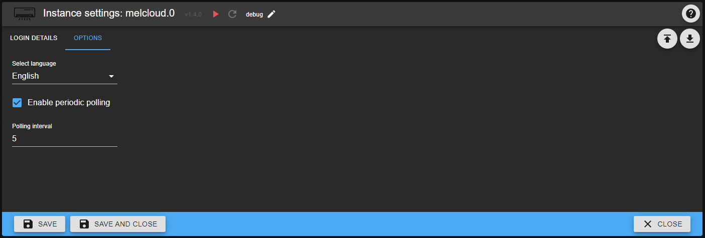

# MELCloud - User guide

## Prerequisites

In order to use this adapter, there are a few things you have to prepare in advance:

- Mitsubishi device with Wi-Fi-Adapter
- MELCloud account at the [official webpage](https://app.melcloud.com/)
- Device registered and set-up in your MELCloud account

## Upgrade notes

- In v1.1.1 the password decryption/encryption was changed. If you are upgrading from a lower version, you must enter your password again in the adapter settings. Otherwise login will fail and the adapter won't connect to the cloud.
- Starting with v1.1.3, js-controller must be installed in v3.1 or higher.
- If you are upgrading to v1.2.0 (or higher), you must completely delete all items under "melcloud.X.devices.Y.reports". Then restart the adapter for the new object structure to be created correctly. The new structure is documented below.
- Starting with v1.3.6, Node.Js 16 is required.
- Starting with v1.3.7, the minimum polling interval is limited to 5 minutes.

## Configuration

Here you can configure your adapter instance. Mandatory for the adapter to work are your MELCloud credentials (email address and password).

On the second tab you need to specify your account region. In addition, you can enable or disable periodic polling of data from MELCloud.
If enabled, the time interval when your device data is polled and updated from MELCloud (minimum 5 minutes to avoid being throttled by MELCloud servers). If the connection to MELCloud should fail at any time (e.g. server problem, internet connection problems), the adapter will try to reconnect up to three times. If there is still no connection after these retries, the next retry will take place after one hour.
As an advanced option, you can define whether SSL errors should be ignored when communicating with the cloud. Only activate this if you know what it means. This option is not normally required!

## Objects

After successful start of the adapter instance (X), your devices are queried by MELCloud. For each device (Y) there will be a separate node.

### melcoud.X.info

| id         | read | write | comment                              |
| ---------- | :--: | :---: | ------------------------------------ |
| connection |  X   |   -   | Indicates the connection to MELCloud |

### Air to air devices (air conditioning)

#### melcloud.X.devices.Y.info

| id                | read | write | comment                                                         |
| ----------------- | :--: | :---: | --------------------------------------------------------------- |
| actualFanSpeed    |  X   |   -   | Actual fan speed when fan is set to auto mode                   |
| buildingId        |  X   |   -   | Assigned building ID                                            |
| canCool           |  X   |   -   | Ability to cool                                                 |
| canHeat           |  X   |   -   | Ability to heat                                                 |
| canDry            |  X   |   -   | Ability to dry                                                  |
| deviceName        |  X   |   -   | Name of the device                                              |
| deviceType        |  X   |   -   | Type of the device                                              |
| deviceOnline      |  X   |   -   | Indicates if device is reachable                                |
| errorMessages     |  X   |   -   | Contains the current error messages of the device (if any)      |
| errorCode         |  X   |   -   | Contains the current error code of the device (8000 = No error) |
| floorId           |  X   |   -   | Assigned floor ID                                               |
| hasError          |  X   |   -   | Indiciates if the device is in error state                      |
| lastCommunication |  X   |   -   | Last communication date/time (MELCloud to device)               |
| minTempCoolDry    |  X   |   -   | Minimal temperature (Cool/Dry)                                  |
| maxTempCoolDry    |  X   |   -   | Maximal temperature (Cool/Dry)                                  |
| minTempHeat       |  X   |   -   | Minimal temperature (Heat)                                      |
| maxTempHeat       |  X   |   -   | Maximal temperature (Heat)                                      |
| minTempAuto       |  X   |   -   | Minimal temperature (Auto)                                      |
| maxTempAuto       |  X   |   -   | Maximal temperature (Auto)                                      |
| macAddress        |  X   |   -   | MAC address of the device                                       |
| nextCommunication |  X   |   -   | Next communication date/time (MELCloud to device)               |
| numberOfFanSpeeds |  X   |   -   | Number of available fan speeds                                  |
| roomTemp          |  X   |   -   | Current room temperature                                        |
| serialNumber      |  X   |   -   | Serial number of the device                                     |

#### melcloud.X.devices.Y.control

| id                      | read | write | comment                                                                                                                                             |
| ----------------------- | :--: | :---: | --------------------------------------------------------------------------------------------------------------------------------------------------- |
| fanSpeed                |  X   |   X   | Current fan speed of the device (0=Auto, 1...'numberOfFanSpeeds'= low to max fan speed)                                                             |
| mode                    |  X   |   X   | Operation mode of the device (1=Heat, 2=Dry, 3=Cool, 7=Vent, 8=Auto)                                                                                |
| power                   |  X   |   X   | Power switch (turns device on/off)                                                                                                                  |
| targetTemp              |  X   |   X   | Target temperature of the device                                                                                                                    |
| timerToggle             |  X   |   X   | Switch used to enable (true) or disable (false) the device's timer                                                                                  |
| vaneHorizontalDirection |  X   |   X   | Current horizontal direction of the device's vane (0=Auto, 1...5=leftmost to rightmost, 8=50/50 (only for devices with 2 separate vanes), 12=Swing) |
| vaneVerticalDirection   |  X   |   X   | Current vertical direction of the device's vane (0=Auto, 1...5=topmost to bottommost, 7=Swing)                                                      |

#### melcloud.X.devices.Y.reports

Before retrieving the power consumption reports you have to set the start ("startDate") and end date ("endDate") correctly. Please pay attention to the correct date format YYYY-MM-DD! Once these are set trigger the state "getPowerConsumptionReport".
Shortly afterwards the corresponding states in the subchannel "lastReportData" are filled with the report data from the cloud.

| id                        | read | write | comment                                                                      |
| ------------------------- | :--: | :---: | ---------------------------------------------------------------------------- |
| startDate                 |  X   |   X   | Start date for the consumption report (format: YYYY-MM-DD, e.g., 2020-05-31) |
| endDate                   |  X   |   X   | End date for the consumption report (format: YYYY-MM-DD, e.g., 2021-01-08)   |
| getPowerConsumptionReport |  -   |   X   | Button to trigger retrieving the power consumption reports                   |

##### melcloud.X.devices.Y.reports.lastReportData

Here are the actual power consumption values for the selected period of time stored.

| id                                   | read | write | comment                                                                                         |
| ------------------------------------ | :--: | :---: | ----------------------------------------------------------------------------------------------- |
| totalMinutes                         |  X   |   -   | Total measurement time (in minutes)                                                             |
| totalPowerConsumption                |  X   |   -   | Total consumption for all operation modes (in kWh)                                              |
| totalPowerConsumption*OperationMode* |  X   |   -   | Total consumption for operation mode _OperationMode_ (in kWh) - created for each operation mode |
| rawPowerConsumptionData              |  X   |   -   | Unprocessed raw report data from the MELCloud (as JSON)                                         |

### Air to water devices (heatpumps)

#### melcloud.X.devices.Y.info

| ID                         | lesbar | änderbar | Bemerkung                                                       |
| -------------------------- | :----: | :------: | --------------------------------------------------------------- |
| buildingId                 |   X    |    -     | Assigned building ID                                            |
| canCool                    |   X    |    -     | Ability to cool                                                 |
| canHeat                    |   X    |    -     | Ability to heat                                                 |
| condensingTemperature      |   X    |    -     | Condensing temperature                                          |
| deviceName                 |   X    |    -     | Name of the device                                              |
| deviceType                 |   X    |    -     | Type of device                                                  |
| deviceOnline               |   X    |    -     | Indicates if device is reachable                                |
| errorMessages              |   X    |    -     | Contains the current error messages of the device (if any)      |
| errorCode                  |   X    |    -     | Contains the current error code of the device (8000 = No error) |
| floorId                    |   X    |    -     | Assigned floor ID                                               |
| flowTemperature            |   X    |    -     | Flow temperature                                                |
| flowTemperatureBoiler      |   X    |    -     | Flow temperature of the boiler                                  |
| flowTemperatureZone1       |   X    |    -     | Flow temperature of zone 1                                      |
| flowTemperatureZone2       |   X    |    -     | Flow temperature of zone 2 (if present)                         |
| hasError                   |   X    |    -     | Indiciates if the device is in error state                      |
| hasZone2                   |   X    |    -     | Flag, if zone 2 is present                                      |
| heatPumpFrequency          |   X    |    -     | Heat pump frequency                                             |
| lastCommunication          |   X    |    -     | Last communication date/time (MELCloud to device)               |
| macAddress                 |   X    |    -     | MAC address of the device                                       |
| mixingTankWaterTemperature |   X    |    -     | Water temperature of the mixing tank                            |
| nextCommunication          |   X    |    -     | Next communication date/time (MELCloud to device)               |
| operationState             |   X    |    -     | Current operation state                                         |
| outdoorTemperature         |   X    |    -     | Outdoor temperature                                             |
| returnTemperature          |   X    |    -     | Return temperature                                              |
| returnTemperatureBoiler    |   X    |    -     | Return temperature of the boiler                                |
| returnTemperatureZone1     |   X    |    -     | Return temperature of zone 1                                    |
| returnTemperatureZone2     |   X    |    -     | Return temperature of zone 2 (if present)                       |
| roomTemperatureZone1       |   X    |    -     | Room temperature of zone 1                                      |
| roomTemperatureZone2       |   X    |    -     | Room temperature of zone 1 (if present)                         |
| serialNumber               |   X    |    -     | Serial number of the device                                     |
| tankWaterTemperature       |   X    |    -     | Temperature of the water tank                                   |

#### melcloud.X.devices.Y.control

| ID                          | lesbar | änderbar | Bemerkung                                                                                                  |
| --------------------------- | :----: | :------: | ---------------------------------------------------------------------------------------------------------- |
| forcedHotWaterMode          |   X    |    X     | Operation mode warm water (false=Automatic, true=Warm water priority)                                      |
| operationModeZone1          |   X    |    X     | Operation mode of zone 1 (0=HEATTHERMOSTAT, 1=HEATFLOW, 2=CURVE, 3=COOLTHERMOSTAT, 4=COOLFLOW)             |
| operationModeZone2          |   X    |    X     | Operation mode of zone 2, if present (0=HEATTHERMOSTAT, 1=HEATFLOW, 2=CURVE, 3=COOLTHERMOSTAT, 4=COOLFLOW) |
| power                       |   X    |    X     | Power switch (turns device on/off)                                                                         |
| setCoolFlowTemperatureZone1 |   X    |    X     | Target temperature of cool flow zone 1                                                                     |
| setCoolFlowTemperatureZone2 |   X    |    X     | Target temperature of cool flow zone 2 (if present)                                                        |
| setHeatFlowTemperatureZone1 |   X    |    X     | Target temperature of heat flow zone 1                                                                     |
| setHeatFlowTemperatureZone2 |   X    |    X     | Target temperature of heat flow zone 2 (if present)                                                        |
| setTankWaterTemperature     |   X    |    X     | Target temperature of the water tank                                                                       |
| setTemperatureZone1         |   X    |    X     | Target temperature of zone 1                                                                               |
| setTemperatureZone2         |   X    |    X     | Target temperature of zone 2 (if present)                                                                  |
| timerToggle                 |   X    |    X     | Switch used to enable (true) or disable (false) the device's timer                                         |

##### melcloud.X.devices.Y.reports.lastReportData

Here are the actual power consumption values for the selected period of time stored.

| id                                   | read | write | comment                                                                                         |
| ------------------------------------ | :--: | :---: | ----------------------------------------------------------------------------------------------- |
| totalMinutes                         |  X   |   -   | Total measurement time (in minutes)                                                             |
| totalPowerConsumption                |  X   |   -   | Total consumption for all operation modes (in kWh)                                              |
| totalPowerConsumption*OperationMode* |  X   |   -   | Total consumption for operation mode _OperationMode_ (in kWh) - created for each operation mode |
| totalPowerProduction                 |  X   |   -   | Total production for all operation modes (in kWh)                                               |
| totalPowerProduction*OperationMode*  |  X   |   -   | Total production for operation mode _OperationMode_ (in kWh) - created for each operation mode  |
| rawPowerConsumptionData              |  X   |   -   | Unprocessed raw report data from the MELCloud (as JSON)                                         |

### Energy recovery ventilators

#### melcloud.X.devices.Y.info

| ID                    | lesbar | änderbar | Bemerkung                                                       |
| --------------------- | :----: | :------: | --------------------------------------------------------------- |
| actualExhaustFanSpeed |   X    |    -     | Actual exhaust fan speed                                        |
| actualSupplyFanSpeed  |   X    |    -     | Actual supply fan speed                                         |
| buildingId            |   X    |    -     | Assigned building ID                                            |
| canCool               |   X    |    -     | Ability to cool                                                 |
| canHeat               |   X    |    -     | Ability to heat                                                 |
| deviceName            |   X    |    -     | Name of the device                                              |
| deviceType            |   X    |    -     | Type of the device                                              |
| deviceOnline          |   X    |    -     | Indicates if device is reachable                                |
| errorMessages         |   X    |    -     | Contains the current error messages of the device (if any)      |
| errorCode             |   X    |    -     | Contains the current error code of the device (8000 = No error) |
| floorId               |   X    |    -     | Assigned floor ID                                               |
| hasError              |   X    |    -     | Indiciates if the device is in error state                      |
| lastCommunication     |   X    |    -     | Last communication date/time (MELCloud to device)               |
| macAddress            |   X    |    -     | MAC address of the device                                       |
| minTempHeat           |   X    |    -     | Minimal temperature (Heat)                                      |
| maxTempHeat           |   X    |    -     | Maximal temperature (Heat)                                      |
| minTempAuto           |   X    |    -     | Minimal temperature (Auto)                                      |
| maxTempAuto           |   X    |    -     | Maximal temperature (Auto)                                      |
| nextCommunication     |   X    |    -     | Next communication date/time (MELCloud to device)               |
| outdoorTemperature    |   X    |    -     | Outdoor temperature                                             |
| roomTemp              |   X    |    -     | Current room temperature                                        |
| serialNumber          |   X    |    -     | Serial number of the device                                     |

#### melcloud.X.devices.Y.control

| ID          | lesbar | änderbar | Bemerkung                                                          |
| ----------- | :----: | :------: | ------------------------------------------------------------------ |
| timerToggle |   X    |    X     | Switch used to enable (true) or disable (false) the device's timer |

### melcloud.X.reports

Similiar to the device-specific reports here you can retrieve aggregated reports for all supported devices. Before retrieving the power consumption reports you again have to set the start ("startDate") and end date ("endDate") correctly. Please pay attention to the correct date format YYYY-MM-DD! Once these are set trigger the state "getCumulatedPowerConsumptionReport".
Shortly afterwards the corresponding states in the subchannel "lastReportData" are filled with the aggregated report data from the cloud.

| id                                 | read | write | comment                                                                      |
| ---------------------------------- | :--: | :---: | ---------------------------------------------------------------------------- |
| startDate                          |  X   |   X   | Start date for the consumption report (format: YYYY-MM-DD, e.g., 2020-05-31) |
| endDate                            |  X   |   X   | End date for the consumption report (format: YYYY-MM-DD, e.g., 2021-01-08)   |
| getCumulatedPowerConsumptionReport |  -   |   X   | Button to trigger retrieving the power consumption reports                   |

#### melcloud.X.reports.lastReportData

Here are the actual aggregated power consumption values for the selected period of time stored.

| id                                   | read | write | comment                                                                                                    |
| ------------------------------------ | :--: | :---: | ---------------------------------------------------------------------------------------------------------- |
| totalMinutes                         |  X   |   -   | Aggregated total measurement time (in minutes)                                                             |
| totalPowerConsumption                |  X   |   -   | Aggregated total consumption for all operation modes (in kWh)                                              |
| totalPowerConsumption*OperationMode* |  X   |   -   | Aggregated total consumption for operation mode _OperationMode_ (in kWh) - created for each operation mode |
| totalPowerProduction                 |  X   |   -   | Aggregated total production for all operation modes (in kWh)                                               |
| totalPowerProduction*OperationMode*  |  X   |   -   | Aggregated total production for operation mode _OperationMode_ (in kWh) - created for each operation mode  |