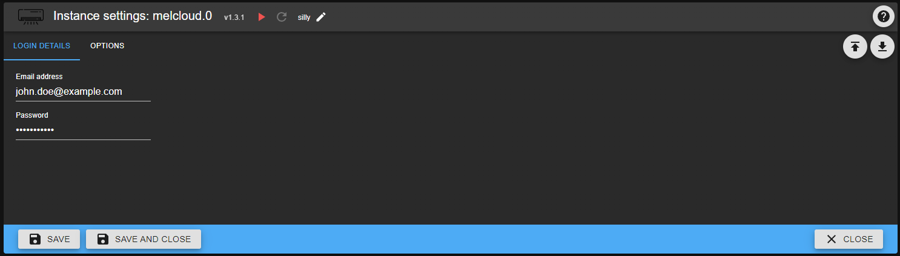

# MELCloud - User guide

## Prerequisites

In order to use this adapter, there are a few things you have to prepare in advance:

* Mitsubishi air conditioning system with Wi-Fi-Adapter MAC-567IF (per device you want to control)
* MELCloud account at the [official webpage](https://app.melcloud.com/)
* All devices registered and set-up in your MELCloud account

## Configuration

Here you can configure your adapter instance. Mandatory for the adapter to work are your MELCloud credentials (email address and password). Additionally you need to specify your account region.

Apart from that you can configure the time interval when your device data is polled and updated from MELCloud (minimum 1 minute). If at any time the connection to MELCloud should fail (e.g. server problem, internet connection issues), the adapter tries at a maximum of three times to reconnect. Should there be still no connection after these retries, the next retry will take place after one hour.

## Objects

After successful start of the adapter instance (X) your devices are queried from MELCloud. For each device (Y) there will be a separate node.

### melcoud.X.info

| id | read | write | comment |
|--- | :---: | :---: |--- |
| connection | X | - | Indicates the connection to MELCloud |

### melcloud.X.device.Y.info

| id | read | write | comment |
|--- | :---: | :---: |--- |
| actualFanSpeed | X | - | Actual fan speed when fan is set to auto mode |
| buildingId | X | - | Assigned building ID |
| canCool | X | - | Ability to cool |
| canHeat | X | - | Ability to heat |
| canDry | X | - | Ability to dry |
| deviceName | X | - | Name of the device |
| deviceOnline | X | - | Indicates if device is reachable |
| floorId | X | - | Assigned floor ID |
| lastCommunication | X | - | Last communication date/time (MELCloud to device) |
| minTempCoolDry | X | - | Minimal temperature (Cool/Dry) |
| maxTempCoolDry | X | - | Maximal temperature (Cool/Dry) |
| minTempHeat | X | - | Minimal temperature (Heat) |
| maxTempHeat | X | - | Maximal temperature (Heat) |
| minTempAuto | X | - | Minimal temperature (Auto) |
| maxTempAuto | X | - | Maximal temperature (Auto) |
| macAddress | X | - | MAC address of the device |
| nextCommunication | X | - | Next communication date/time (MELCloud to device) |
| numberOfFanSpeeds | X | - | Number of available fan speeds |
| roomTemp | X | - | Current room temperature |
| serialNumber | X | - | Serial number of the device |

### melcloud.X.device.Y.control

| id | read | write | comment |
|--- | :---: | :---: |--- |
| fanSpeed | X | X | Current fan speed of the device (0=Auto, 1...'numberOfFanSpeeds'= low to max fan speed) |
| mode | X | X | Operation mode of the device (1=Heat, 2=Dry, 3=Cool, 7=Vent, 8=Auto) |
| power | X | X | Power switch (turns device on/off) |
| targetTemp | X | X | Target temperature of the device |
| vaneHorizontalDirection | X | X | Current horizontal direction of the device's vane (0=Auto, 1...5=leftmost to rightmost, 8=50/50 (only for devices with 2 seperate vanes), 12=Swing) |
| vaneVerticalDirection | X | X | Current vertical direction of the device's vane (0=Auto, 1...5=topmost to bottommost, 7=Swing) |

### melcloud.X.device.Y.reports

| id | read | write | comment |
|--- | :---: | :---: |--- |
| startDate | X | X | Start date for the consumption report (format: YYYY-MM-DD, e.g. 2020-05-31) |
| endDate | X | X | End date for the consumption report (format: YYYY-MM-DD, e.g. 2021-01-08) |
| getPowerConsumptionReport | - | X | Button to trigger retrieving the power consumption reports |
| reportedMonths | X | - | Array containing all months with measurements (1 = January, ..., 12 = December) |
| totalMinutes | X | - | Total measurement time  (in minutes) |
| totalPowerConsumption*OperatioMode* | X | - | Total consumption in operation mode *OperatioMode* (in kWh) - created for each operation mode |
| totalPowerConsumption*OperatioMode* *Month* | X | - | Total consumption in operation mode *OperatioMode* for month *Month* (in kWh) - created for each operation mode and month |